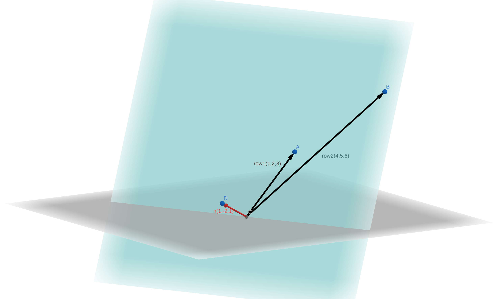
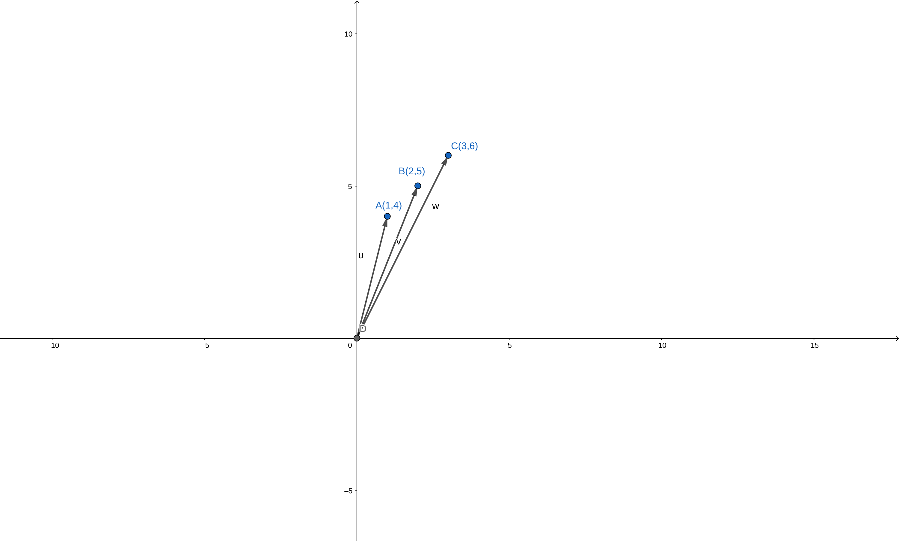

# 前言

线性代数，同微积分一样，是高等数学中两大入门课程之一，它除了是一门数学课程，也是非常好的工具类学科，在很多的领域都有涉及，比如在人工智能领域，机器学习和数值优化。它的研究对象是**向量**，**向量空间**（或称线性空间），**线性变换**和**有限维的线性方程组**。从线性空间的角度作为切入点，我们能够更好地理解向量，矩阵以及矩阵的特征值、特征向量、相似矩阵、正定矩阵、奇异值分解等等。在这里，我强烈推荐MIT教授William Gilbert Strang的MIT 18.06 Linear Algebra课程，视频能够在youtube或者是网易公开课上找到。他讲解线性代数的思路很容易理解，更重要的是他从空间的角度出发，很自然轻松地解释所有的内容。在他的课程当中，给我印象最深的就是矩阵的四个子空间部分。下面我们逐步深入下去，从空间的概念讲起，逐步到达线性代数最核心的概念：矩阵的四个子空间。

# 空间

提到空间，我们首先想到的就是我们生活在三维环境，站在数学的角度上看，这是一个三维的欧几里得空间。经过数学家们的不断思考，他们用最凝练的语言描述空间的共同特点：  

1. 由无穷多的点组成；  
2. 不同点之间存在着可以描述的相对关系；  
3. 在空间中通过点定义长度、角度；  
4. 容纳运动，或者更宽泛来讲就是容纳变换。 

上面的这些性质中，最最关键的是第4条。第1、2条只能说是空间的基础，不算是空间特有的性质，凡是讨论数学问题，都得有一个集合，大多数还得在这个集合上定义一些结构（关系），并不是说有了这些就算是空间。而第3条太特殊，其他的空间不需要具备，更不是关键的性质。只有第4条是空间的本质，也就是说，容纳运动是空间的本质特征。 有句话叫做：“静止是相对的，运动才是绝对的。”我们思考的起点，必须要做到“运动”，即变换是运动，状态其实也是运动，只不过这个特殊的运动是从我们很难发觉的特殊起点开始的。这点我们将在后面讲到。

# 线性空间

线性空间（Vector Space or Linear Space）的定义源于许多数学对象本身如何归类，例如几何向量、同型矩阵、实函数等等，它们满足相同的计算规则，都能够相加以及用数相乘，将它们称为**向量**。向量的一个集合$$V$$，如果对于$$V$$中的任意向量$$u$$、$$v$$和一个数集$$F$$内的数$$a$$、$$b$$，满足：

- 加法封闭性：$$(u+v)\in V$$
- 数乘封闭性：$$au \in V$$，$$(au+bv)\in V$$

那么，这个空间就是一个线性空间。

线性空间中的对象如何表达？

我的理解：两个关键点：一个是一组合适的基，另一个是这些基的有序求和（坐标）。
$$
\begin{bmatrix}	     a_{0 ,0 }& a_{0,1} & a_{0, 2 }& \cdots & a_{0, n -1} \\   a_{1, 0 }& a_{1, 1} & a_{1 ,2 }& \cdots & a_{1 ,n -1}\\     \vdots  & \vdots& \vdots & \ddots & \vdots \\     a_{n-1 ,0 }& a_{n-1 ,1} & a_{n-1, 2 }& \cdots & a_{n-1, n -1}     \end{bmatrix}\begin{bmatrix}k_0\\k_1  \\\vdots  \\k_{n-1    }\end{bmatrix}=k_0\begin{bmatrix}a_{0,0}\\a_{1,0} \\\vdots  \\a_{n-1,0}\end{bmatrix}+k_1\begin{bmatrix}a_{0,1}\\a_{1,1} \\\vdots  \\a_{n-1,1}\end{bmatrix}+\cdots+k_{n-1}\begin{bmatrix}a_{0,n-1}\\a_{1,n-1} \\\vdots  \\a_{n-1,n-1}\end{bmatrix}
$$
上面的等式在向我们展示线性代数最最重要的一个变换--线性组合。一组合适的基隐藏在了等式左边的矩阵每一个列向量当中，而那个坐标隐藏在了等式左边矩阵右乘的向量当中。按列取出每一个列向量再该方向上做一个伸缩得到新的向量，最后再把这些向量求和就是这个线性组合的操作。这里，有些人会问，那你说的空间里面的对象在哪里？答案就是这个变换。**对象就是变换，而变换产生了对象**。我们在教材或者文献当中看到的向量，其实只是描述对象的一部分，其余的隐藏在其左侧的那个透明矩阵当中，而这个矩阵可能是一个写为$$I$$的单位矩阵，这个特殊的矩阵每一个列向量都是单位正交化的向量，比如在三维空间中代表了$$x,y,z$$三个坐标轴。

# 向量

通过对线性空间的理解，我们进一步看看向量这个“标签”：就像我们看到“奔驰汽车”，从我们的先验知识库中寻找到这四个汉字，再从这些汉字的组合上面获取到其背后的语义，根据这个语义想象出实际的车的模样，比如`GLC`或`S Class`。向量的功能类似于标签，它仅仅是一串有序排列的数字，想要对线性空间当中的对象进行描述，就必须搭配一个基底，即那个左侧的矩阵。相同的对象，其实可以由不同的矩阵和向量的组合来表达，反过来，不同的对象，可以由相同的向量和不同的基底组合表达。**基底和向量二者缺一不可，没有基底，向量就是一堆毫无意义的数字。**

# 矩阵

矩阵是向量的有序组合。矩阵的本质是描述线性变换。它在线性空间当中的作用是告诉我们对象改变，也就是通过矩阵规定了这个对象是如何发生变换的。是否可以这样理解，线性代数能够神奇地将本来和对象描述相关的向量组合在一起变成对象变换相关的矩阵。从静到动的一个过程。

基于上面的描述，我对矩阵的理解如下：

- 矩阵是由一系列的列向量按照一定的次序排列而成
- 矩阵描述了线性空间的变换
- 基就是线性空间的坐标系，不是坐标值，有区别
- 基和向量相乘能够描述一个对象

已经有人准备开始质疑：刚才说到，矩阵（我们考虑最常见的非奇异的方阵，因为这一类矩阵是帮助我们理解问题的主要形式，把握住了这一点，遇到其他的杂七杂八的不合格矩阵，我们再想办法对付）的列向量如果是线性无关的，它们就能成为度量该线性空间的基，也就是该空间的完备坐标体系，基于这个坐标系，我们就可以使用某一个向量描述这个空间内的任何对象了。从这个方面理解，结论是：矩阵描述了一个坐标系。那为什么矩阵还能够描述变换呢？难道这里存在什么矛盾吗？到这里，教科书上面从来不讲的东西就引出来了：运动（变换）是相对的。也就是说，坐标系下面对象的变换与固定对象去变换坐标系是完全等价的。举个栗子：  考察 
$$
Ma=b=Ib
$$
有如下的理解方式：

理解1：向量$$a$$经过$$M$$所描述的变换变成了$$b$$。

理解2：空间内有一个对象，上面的等式就是同一个对象的不同描述方式，这个对象在$$M$$坐标系下坐标值是$$a$$，而在$$I$$坐标系下坐标值是$$b$$。

那么，是不是这个等式还能够写下去呢？答案是肯定的：因为我们总是一直能够找到不同的$$M$$，后面的相似矩阵、甚至是对角化等等的内容，都是为了保证变换前后的矩阵描述的是同一个线性变换。从计算机的运算来讲，如何在这么多的选择当中找到最合适的就显得很重要了，例如对于$$e^A$$这样的指数运算，可以展开为矩阵的多项式运算，如果找到了合适的对角矩阵，就能够很大程度地降低运算负担，提升效率。

# 矩阵的乘法

考察$$PQ$$:

变换的思考方式：对$$P$$的每一个列向量，施加$$P$$代表的变换

坐标系的思考方式：在$$P$$坐标系下观察$$Q$$的每一个列向量（组合起来为$$Q$$的坐标系），等同于在$$I$$下观察$$PQ$$

# 矩阵的四个子空间

给定一个矩阵$$A$$， 它的行向量、列向量可以分别构成两个该矩阵的子空间，分别称为行空间和列空间。为了更细致地分析这个问题，我们特别地举一个例子：
$$
A=\begin{bmatrix}1&2&3\\4&5&6\end{bmatrix}
$$
该矩阵的三个列向量分别是$$\boldsymbol {col_1}=\begin{bmatrix}1\\4\end{bmatrix},\boldsymbol {col_2}=\begin{bmatrix}2\\5\end{bmatrix},\boldsymbol {col_3}=\begin{bmatrix}3\\6\end{bmatrix}$$，三个向量一定是线性相关的。两个行向量分别是$$\boldsymbol {row_1}=\begin{bmatrix}1\\2\\3\end{bmatrix},\boldsymbol {row_2}=\begin{bmatrix}4\\5\\6\end{bmatrix}$$.

- 行空间(Row) $$C(A^T)$$：由行向量构成的一组线性无关的向量组，对这组向量进行任意的线性组合所产生向量构成的子空间。
- 列空间(Colunm) $$C(A)$$：由列向量构成的一组线性无关的向量组，对这些向量进行任意的线性组合所产生向量构成的子空间。
- 零空间（Null） $$N(A)$$：满足$$Ax=0$$的所有$$x$$构成的子空间。
- 左零空间(Left Null) $$N(A^T)$$：满足$$A^Tx=0$$ 的所有$$x$$构成的子空间。

下面我们探讨一下四个空间的关系。

图中，$$\boldsymbol {row1}$$和$$\boldsymbol {row2}$$是两个行向量，由于它们线性无关，可以作为行空间的一组线性无关的基，它们的线性组合生成的所有向量是一个蓝色平面。$$\boldsymbol n$$是垂直于这个平面的零向量，由于零空间里线性无关的向量只有这一根（单方向），所以这些向量形成的是一根直线，在这条直线上面的所有向量都属于该空间。
这里需要解释一下，为什么垂直？两个向量垂直，就是两个向量的内积为0。我们回想一下矩阵和向量的乘法规则，以上面的矩阵为例：
$$
Ax=0
$$

$$\boldsymbol {row1}^T \cdot \boldsymbol n = 1 \times 1 + 2 \times (-2) + 3 \times 1 = 0$$, $$\boldsymbol {row2}^T \cdot \boldsymbol n =4 \times 1 + 5 \times (-2) + 6 \times 1 = 0$$，两个$$0$$ 按列排好，就是拥有两个元素的零列向量。引申一下，两个空间垂直：取空间中任意一个向量和另一个向量做内积，如果结果都为0，那么这两个空间垂直。一般性地，矩阵的行空间和零空间垂直！这里再引入秩（Rank）,$$R(Row) + R(Null) = n$$，$$\boldsymbol n$$是矩阵的列数（也是行向量的维度）。

类似地，我们看一下列空间的情况：三个列向量分别是$$\boldsymbol u,\boldsymbol v,\boldsymbol w$$，这三个向量线性相关，张成的子空间是二维的平面，左零空间的二维向量只有0.
## 总结
矩阵的四个子空间概念非常非常重要，几乎贯穿线性代数的所有内容，能够极大地帮助我们理解线性变换，理解矩阵的重要性质和特殊矩阵的特性。后面的几篇博客会反复提到这个概念。
# 向量空间的思维扩展
关于微分方程（Differential Equations），在求解方程的解时，一个关键点就是求解解空间的一组基函数。只要确定了基函数，我们就可以将基函数进行线性组合得到整个解空间。需要说明的是，向量的线性组合可以很容易地对应到函数的线性组合，但是函数的“内积”如何对应？答案就是先求乘积，再在定义域上面把所有的乘积求积分得到“内积”，有一些相似，但是有区别。这里我想说的是，线性代数给了我们一个世界观，这个世界观可以帮助我们解释很多并行世界的问题，而且很有效。